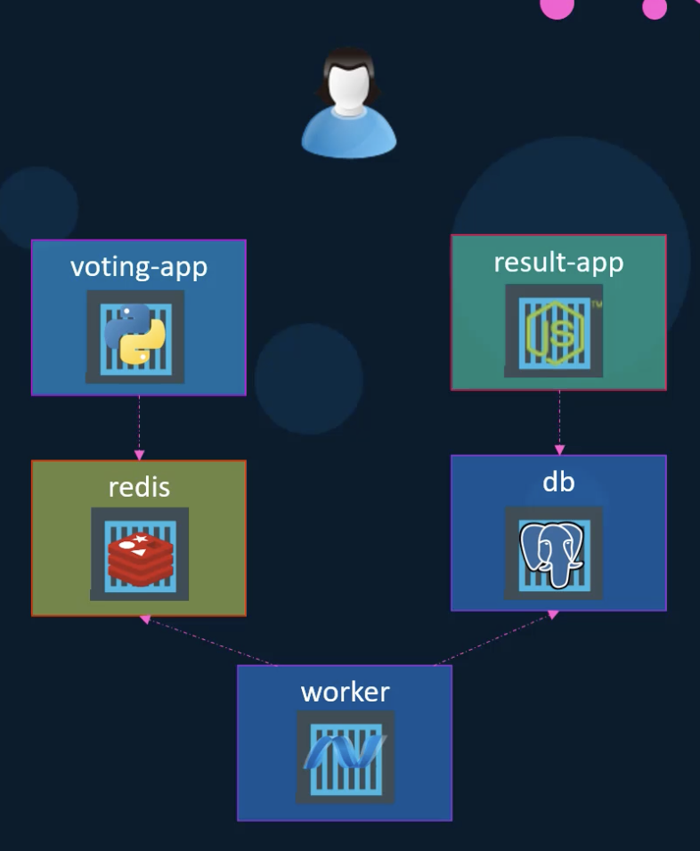
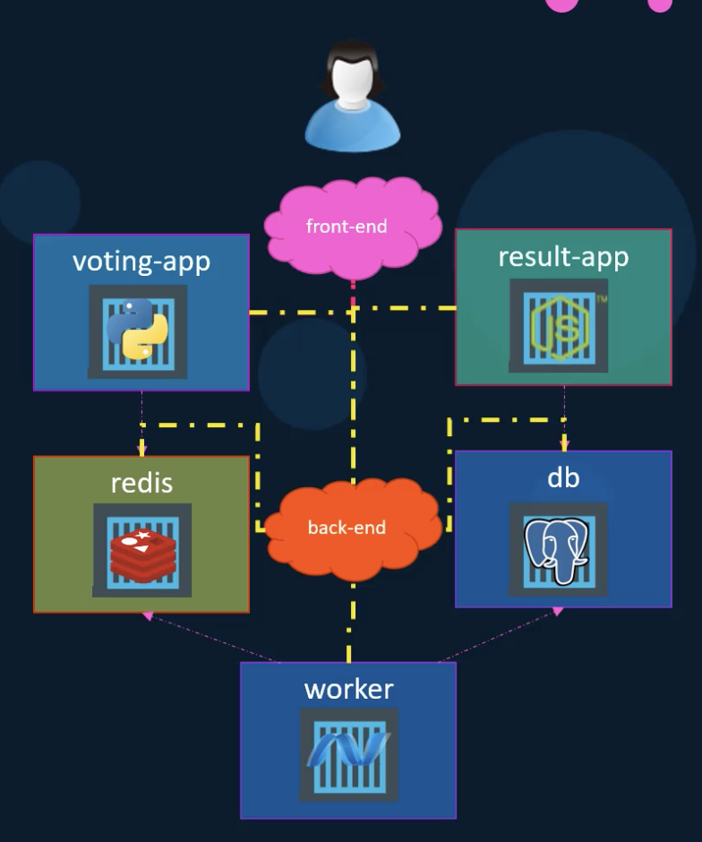

## Docker compose

docker compose는 많은 컨테이너를 한 개의 docker host 상에서 동작시킨다.
Yaml 파일을 통해서 작성한다.

## Example



위와 같은 앱을 기존 docker 명령어를 이용해서 만들어보고 docker-compose를 이용했을 때와 비교해보도록 하겠습니다.

### Docker

#### docker run

```
docker run -d --name=redis redis

docker run -d --name=db postgres

docker run -d --name=vote -p 5000:80 voting-app

docker run -d --name=result -p 5001:80 result-app

docker run -d --name=worker worker
```

하지만 커맨드를 실행하게 되면 문제가 생깁니다.
컨테이너는 문제없이 실행되지만 컨테이너가 서로 연결되어있지 않아서 의존관계가 있는 서비스는 제대로 동작하지 않게 됩니다.
예를 들면 voting-app 컨테이너는 redis 컨테이너와 의존관계이기 때문에 voting-app 컨테이너는 제대로 동작하지 못합니다.

### docker run --links

위의 문제를 해결하기 위해서 의존관계가 있는 컨테이너에 --links를 이용합니다.

```
docker run -d --name=redis redis

docker run -d --name=db postgres

docker run -d --name=vote -p 5000:80 --link redis:redis voting-app

docker run -d --name=result -p 5001:80 --link db:db result-app

docker run -d --name=worker --link db:db --link redis:redis worker
```

### Docker compose

위의 커맨드는 문제없이 동작할 것입니다 하지만 이러한 코드는 직관성이 떨어지며 마이크로 서비스가 늘어남에 따라서 점점 복잡해질 것입니다.
여기서 docker-compose 를이용하면 yaml파일을 통해서 설정들을 간결하고 알아보기 쉽게 작성함으로써 위의 문제를 해결할 수 있습니다.

```
// docker-compose.yml

redis:
    image: redis
db:
    image: postgres:9.4
vote:
    image: voting-app
    ports:
        - 5000:80
    links:
        - redis
result:
    image: result-app
    ports:
        - 5001:80
    links:
        - db
worker:
    image: worker
    links:
        - redis
        - db
```

- 여기서 links 아래의 `db` 는 `db:db` 와 같은 의미입니다.

이러한 docker-compose 파일은 아래의 간단한 명령어로 모든 컨테이너를 실행시킬 수 있습니다.

```
docker-compose up
```

### Docker compose - build

```
// docker-compose.yml

redis:
    image: redis
db:
    image: postgres:9.4
vote:
    build: ./vote
    ports:
        - 5000:80
    links:
        - redis
result:
    build: ./result
        ports:
            - 5001:80
        links:
            - db
worker:
    build: ./worker
    links:
        - redis
        - db
```

특정 마이크로 서비스를 직접 만들어서 사용하고 있다면 `image:` 설정이 아닌 `build:`를 이용하여 dockerfile이 존재하는 위치를 지정함으로써
그 위치의 dockerfile을 빌드하여 바로 사용하도록 할 수도 있습니다.

### Docker compose - versions

#### Version 1

```
// docker-compose.yml

redis:
    image: redis
db:
    image: postgres:9.4
vote:
    image: voting-app
    ports:
        - 5000:80
    links:
        - redis
```

- docker compose가 모든 컨테이너를 Default Bridge Network에 연결합니다. 그리고 위처럼 links로 직접 연결해줘야 합니다.

#### Version 2

```
// docker-compose.yml
version: 2
services:
    redis:
        image: redis
    db:
        image: postgres:9.4
    vote:
        image: voting-app
        ports:
            - 5000:80
        depends_on:
            - redis
```

- version 2 에서는 `version: 2` 를 통해서 버전을 지정해줘야 합니다.
- docker compose는 애플리케이션에 Dedicated Bridge Network를 만들고 자동으로 모든 컨테이너를 거기에 연결합니다. 이를 통해 컨테이너들은 서로의 `서비스 이름`을 통하여 네트워킹이 가능합니다. 또한 `links:` 를 통해서 연결할 필요가 없습니다.
- `depends_on:` 이 새롭게 생겼습니다. 이것은 특정 서비스를 실행하기 전에 해당 서비스가 존재해야 한다 라는 의존성을 부여할 수 있게 합니다.

#### Version 3

```
// docker-compose.yml
version: 3
services:
    redis:
        image: redis
    db:
        image: postgres:9.4
    vote:
        image: voting-app
        ports:
            - 5000:80
```

- 기본적으로 version 2와 동일하며 몇몇 기능이 추가되거나 사라졌습니다.

### Docker compose - network



여기서 만약 위와 같이 통합된 네트워크가 아닌 프런트엔드와 백엔드로 나눠서 관리하고 싶다면 아래와 같이 `networks` 를 지정해주면 됩니다.

```
// docker-compose.yml

version: 2
services:
    redis:
        image: redis
        networks:
            - back-end
    db:
        image: postgres:9.4
        networks:
            - back-end
    vote:
        image: voting-app
        networks:
            - front-end
            - back-end
    result:
        image: voting-app
        networks:
            - front-end
            - back-end

networks:
    front-end:
    back-end:
```
