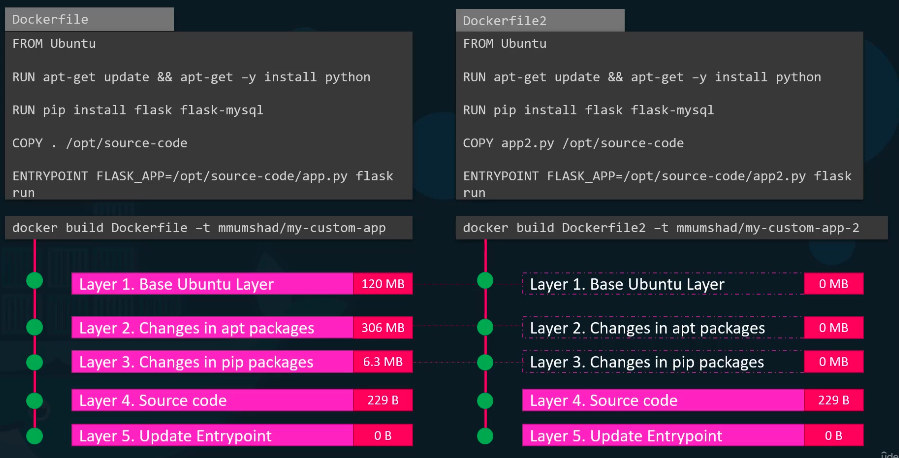
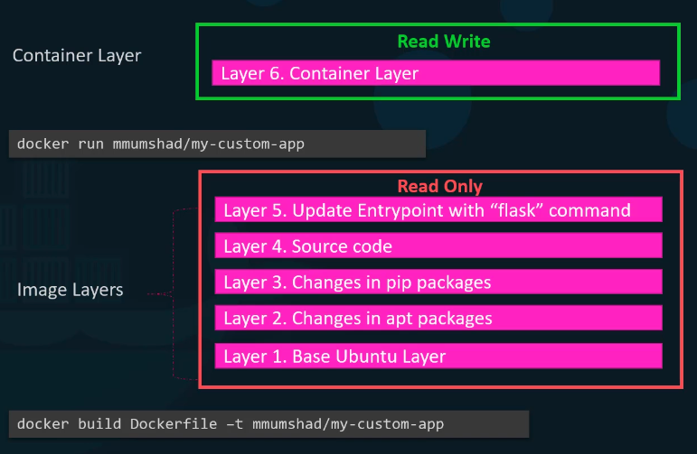

### Docker Storage

도커는 어떻게 파일을 저장하고 관리하는가

#### File system

도커는 기본적으로
```
/var/lib/docker
    aufs
    containers
    image
    volumes
```
아래에 데이터를 저장합니다.

우선 저희는 도커가 어떻게 이미지, 볼륨등을 저장하는지 이해하려면 layered architecture를 알아야합니다.

#### Layered architecture

도커는 도커파일을 실행할 때 각 라인을 레이어로 구분하며, 각 레이어별로 이전 레이어와의 차이점을 가집니다.
이는 각 레이어를 작게 유지하게 해줍니다.


Dockerfile2는 다른 소스코드, 엔트리포인트를 가진 도커파일입니다.
이 도커파일은 실행 될 때 이전에 빌드했던 Dockerfile의 Layer 1~3을 캐시에서 가져옮으로써 빠르게 빌드 할 수 있게 해줍니다.
이는 저희의 어플리케이션이 빌드와 업데이트를 빠르게 할 수 있도록 해줍니다.


이러한 도커파일을 통해 빌드를 하게되면 Image Layer를 생성하게됩니다.
이 Image Layer은 읽기 전용이며 쓰기는 불가능합니다.
docker run 커맨드를 통해 해당 이미지를 실행시키면 읽기 쓰기가 가능한 Container Layer를 생성하게 됩니다.
Container Layer는 실행중 변경된 데이터를 저장하고 도커가 중단되면 이러한 데이터는 사라지게됩니다.

##### Copy On Write

Image Layer는 읽기 전용이기 때문에 소스코드를 수정하는것이 불가능할 것 같지만, Container Layer에서도 소스코드를 변경할 수 있습니다.
하지만 이는 Image Layer에서 수정하는 것이 아닌, 읽기 쓰기가 가능한 Container Layer에 복사본을 만들어서 수행하게 됩니다.

### Volumes

도커에서는 볼륨을 생성하여 할당 시킬 수 있습니다.
```
docker volume create data_volume    // 볼륨 생성

docker run -v data_volume:/var/lib/mysql mysql  // 생성한 볼륨 할당

docker run -v data_volume2:/var/lib/mysql mysql // 볼륨 생성 및 할당
```

-v 로도 설정이 가능하지만 좀더 권장되는 방법은 `--mount`를 사용하는 것입니다.
```
docker run \
--mount type=bine,source=/data/mysql,target=/var/lib/mysql mysql
```

#### Type of mount

##### volume mount
볼륨 마운트는 `/volume` 에 마운트를 합니다.

##### bind mount
바인드 마운트는 docker host 이하의 어느곳에든 마운트하는것이 가능합니다.

#### Storage drivers

도커는 레이어드 아키텍쳐를 이용하기 위해서 Storage drivers를 이용합니다.
예를들면 AUFS, ZFS, BTRFS, Device Mapper 등이 있습니다.
도커는 자동으로 OS에 맞춰 Storage drivers를 지정해줍니다.