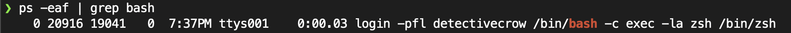

### Docker Engine

처음 리눅스 호스트에 도커를 설치하면 당신은 실제로 아래와 같이 세 가지 요소를 설치하게 됩니다.

- Docker demon
  도커 데몬은 이미지나 컨테이너, 볼륨, 네트워크 등의 도커 오브젝트를 관리하는 백그라운드 프로세스입니다.
- REST API server
  도커 데몬에 소통하기 위한 API 인터페이스입니다.
- Docker CLI
  컨테이너의 실행, 종료, 이미지의 삭제 등을 할 수 있는 커맨드 라인 인터페이스입니다.
  도커 CLI는 REST API를 이용하여 도커 데몬과 동작하게 됩니다.
  또한 도커 CLI는 같은 도커 Host가 아니더라도 아래와 같이 Host를 지정하여 REST API를 동작시킬 수 있습니다.
  ```
  docker -H=10.123.2.1:2375 run nginx
  ```

### Containerization

##### 도커에서 어떻게 애플리케이션은 컨테이너화 되는가

도커는 각각의 고립된 작업공간을 namespace로 구분 지으며 각각 process id, network, mount, inter process, Unix timesharing 등을 가지고 있습니다.
이러한 namespace는 컨테이너 간의 고립을 제공해줍니다.


### Namespace - PID

##### 리눅스에서 여러 프로세스들이 동작할 때 도커에서는 어떻게 해당 프로세스를 독립적으로 관리하는가

도커에서 프로세스를 시작하게 되면 리눅스 시스템에서 프로세스를 실행하여 새로운 번호를 부여하게 됩니다.
도커에서는 해당 namespace 별로 컨테이너 안에서만 볼 수 있는 PID를 부여해 관리합니다.

##### 참고

같은 작업이지만 PID 번호가 다르다.



### cgroups (control groups)

##### 리소스 (CPU, Memory)를 관리하는 방법

도커에서는 cgroups를 통하여 하드웨어 리소스를 각 컨테이너에 할당합니다.

```
docker run --cpus=. 5 ubuntu // cpu를 50%로 제한
```

```
docker run --memory=100 ubuntu // memory를 100mb로 제한
```
