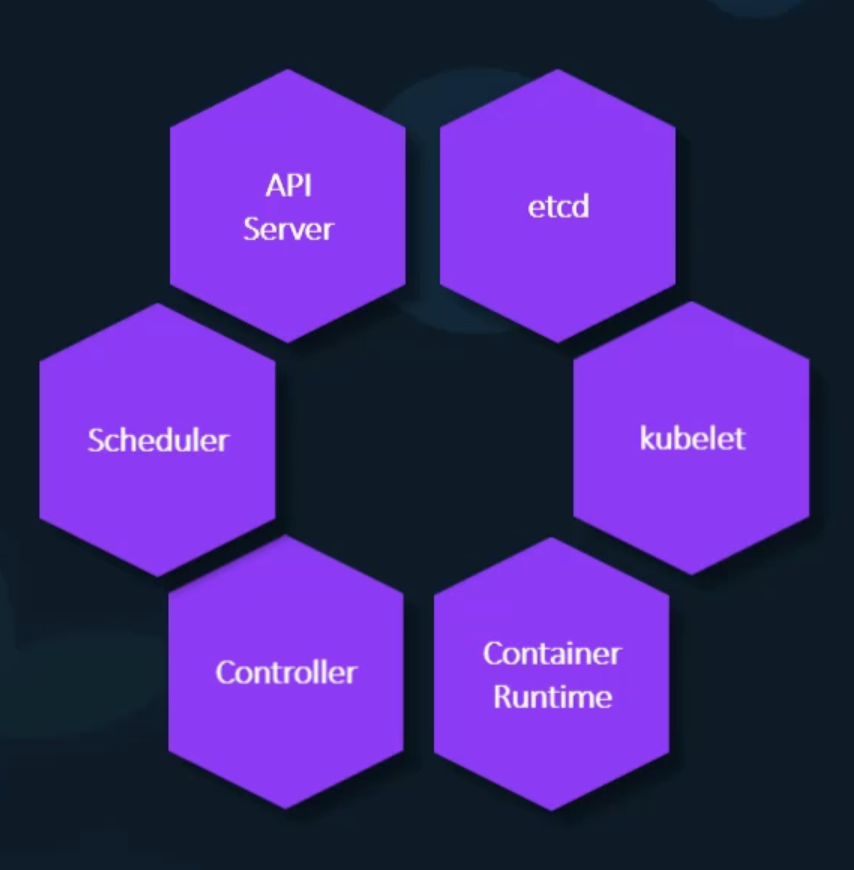

## Container Orchestration

### Why Orchestrate

도커 호스트에 컨테이너를 여러 개 실행시키고 있을 때 만약 그중 하나의 컨테이너가 문제가 생기면? 호스트에 문제가 생기면?
-> 직접 커맨드를 통해서 재실행시켜야 합니다.
이러한 문제들을 자동으로 수리하고 가용성, 확장성을 확보하기 위해서 Orchestration을 사용합니다.

### Container Orchestration

전형적인 오케스트레이션 방법 중 하나는 여러 대의 도커 호스트를 가지고 있는 것입니다.
하나가 실패하더라도 다른 유효한 호스트에서 요청을 받아 처리하는 방식으로 문제를 해결합니다.

```
docker service create --replicas=100 nodjs
```

위는 간단한 docker swarm의 코드로, `--replicas=***` 을 통해 복수의 인스턴스를 실행시킬 수 있습니다.

그 외의 다양한 오케스트레이션 서비스는 이외에도

- 접속자 수가 많으면 인스턴스의 수를 증가시키고, 줄어들면 인스턴스의 수를 줄이는 스케일 업, 스케일 다운
- 도커 호스트의 수를 증가, 감소시키는 스케일 아웃, 스케일 인
  등의 기능이 있으며 컨테이너 오케스트레이션은 단순히 인스턴스의 수를 증가시키는 것이 아니라, 네트워크, 스토리지, 로드밸런싱 또한 관리합니다.

### Solutions

- Docker Swarm
  세팅이 간단하여 사용하기 쉽지만, 몇몇의 오토스케일링 기능들이 없기에 복잡한 제품 레벨에 사용하기 부적합한 부분이 존재합니다.
- kubernetes
  최근 많은 주목을 받고 있으며 여러 클라우드 서비스에서도 지원하기 시작했습니다.
- MESOS
  세팅이 어렵다는 단점이 존재합니다.

## Docker swarm

도커 스웜은 복수의 도커 머신을 하나의 클러스터에서 다룰 수 있게 해 줍니다.
도커 스웜은 인스턴스를 각자 다른 도커 호스트에서 동작시키며 높은 가용성과 로드밸런싱을 제공합니다.

### Setup swarm

도커 스웜은 하나의 `Swarm Manager` 와 복수의 `Worker` 도커 호스트를 가집니다.

아래와 같이 `Swarm Manager` 에서 initialize 하고 `Worker` 에서 join 시킵니다.

- Swarm Manager

```
docker swarm init
```

- Node Worker

```
docker swarm join --token <token>
```

- Node Worker

```
docker swarm join --token <token>
```

- Node Worker

```
docker swarm join --token <token>
```

### Docker service

위의 설정을 간단하게 하기 위해서 `docker swarm orchestration`인 `docker service` 를 사용합니다.

```
docker service create --replicas=3 my-web-server

docker service create --replicas=3 -p 8080:80 my-web-server

docker service create --replicas=3 --network frontend my-web-server
```

`docker service` 커맨드는 `docker run` 과 비슷하게 `-p`, `--network` 등의 옵션 또한 사용 가능합니다.

- `docker service` 커맨드는 Worker 가 아닌 Manager 노드에서 실행시켜야 합니다.

## Kubernetes

쿠버 네티스에서는 한 개의 커맨드로 수천 개의 애플리케이션을 기동시킬 수 있습니다.

```
kubectl run --replicas=1000 my-web-server
```

쿠버 네티스에서는 손쉽게 유저의 접속량에 따라서 스케일 업, 스케일 다운시킬 수 있습니다.

```
kubectl scale --replicas=2000 my-web-server
```

쿠버 네티스에서는 손쉽게 롤링 업데이트를 할 수 있습니다.

```
kubectl rolling-update my-web-server --image=web-server:2
```

또한 손쉽게 롤 백 또한 가능합니다.

```
kubectl rolling-update my-web-server --rollback
```

도커와 쿠버 네티스는 어떠한 관계? 쿠버 네티스는 도커 호스트를 애플리케이션을 호스팅 하는 데에 사용합니다. (도커 대신에 Rocket이나 cri-o 등을 사용하는 것도 가능합니다.)

### Nodes

쿠버 네티스의 클러스터는 Node의 집합으로 이루어져 있습니다.

Node란 물리적 혹은 가상 머신으로 쿠버 네티스의 소프트웨어나 툴이 설치돼있습니다.
또한 Node는 Worker 머신으로 쿠버 네티스에서 컨테이너가 실행되는 장소이기도 합니다.

만약 Node가 모종의 이유로 종료된다면 어떻게 될까요?
당연히도 저희의 애플리케이션은 다운될 것입니다. 따라서 저희는 두 개 이상의 노드가 필요합니다.

### Cluster

Cluster란 Node의 집합입니다.

따라서 한 개의 노드가 실패하더라도 저희의 애플리케이션은 여전히 다른 노드를 통해 문제없이 동작할 것입니다.

그런데 저희는 Cluster를 가지고 있지만 어떠한 클러스터가 존재하는지 파악하고, 모니터링하는 등 누가 이 Cluster을 관리하는 걸까요?

### Master

Master는 쿠버 네티스의 Control Plane이 설치되어있는 Node입니다.
Master는 Cluster안에서 Node들을 지켜보며 Worker Nodes에 대한 실질적인 오케스트레이션 역할을 맡습니다.

### Components

저희가 만약 쿠버 네티스를 시스템에 설치하면 아래와 같은 컴포넌트들 또한 같이 설치하게 됩니다.



#### API Server

API Server는 쿠버 네티스에서 프런트엔드 역할을 합니다.
유저, 관리 툴, CLI 등 모두 API Server을 통해서 쿠버 네티스 클러스터와 상호작용합니다.

#### etcd

etcd는 distributed reliable key value 저장소로 클러스터를 관리하기 위한 모든 정보를 저장합니다.

#### Scheduler

Scheduler는 여러 노드에게 작업이나 컨테이너를 분산시키거나 새로 생성한 컨테이너를 노드에게 할당시키는 일을 합니다.

#### Controllers

Controllers는 오케스트레이션의 뒤에서 두뇌의 역할을 합니다.
이는 노드나 컨테이너, 엔드포인트가 종료되는 것을 알아차리고 새로운 컨테이너를 만드는 일등을 결정하는 일을 합니다.

#### Container Runtime

Container Runtime은 컨테이너를 동작시키는 데 사용하는 기본 소프트웨어를 말합니다. 저희의 경우 도커가 될 것입니다.

#### kublet

마지막으로 kublet은 클러스터 안의 각 노드들에서 동작하는 대리인(대표)으로써 컨테이너가 의도한 대로 동작하는가 확인하는 역할을 합니다.

### kubectl

kubectl(kube control tool) 이란 kubernetes CLI 로써 쿠버 네티스 클러스터에 애플리케이션을 배포하고 관리하는 기능을 합니다.
클러스터의 관계 정보를 취득, 클러스터에 속한 노드들의 상태 취득 등등의 작업을 할 수 있습니다.
